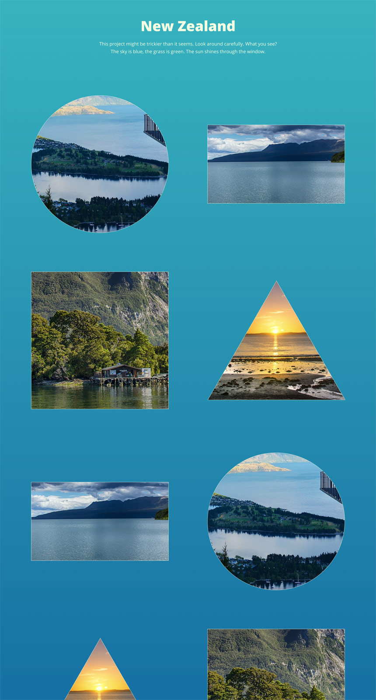

Front-end / WordPress Test Project
======================

## Project brief
Convert the following designs to HTML/CSS/JS/WordPress.

### Infinite scroll gallery

## Requirements
1. Create project using [Chisel](https://www.getchisel.co/)
1. Use HTML5 / SCSS
1. Make it responsive using your best judgement
1. Allow to choose thumbnail shape in WordPress admin
1. Create custom infinite scroll effect - use custom JavaScript and PHP, don't use existing infinite scroll WordPress plugins
1. Enter enough sample images to demonstrate the effect

## Design
Design is available in [Figma](https://www.figma.com/) at https://www.figma.com/file/eND2gJEU1sXfKfHawR0LyH/Xfive-Front-end-WP-Test. If you haven't already, sign up for a free Figma account, so you can work with the design.

The following images are used in the design:
 -  https://pixabay.com/en/new-zealand-lake-mountain-landscape-679068/
 -  https://pixabay.com/en/new-zealand-lake-web-kai-dock-583176/
 -  https://pixabay.com/en/new-zealand-doubtful-sound-fjord-583181/
 -  https://pixabay.com/en/sun-rise-beach-new-zealand-auckland-661541/

## Supported browsers
Ensure that the elements work and display correctly in the following browsers:

- Firefox (latest version)
- Google Chrome (latest version)
- Microsoft Edge
- Internet Explorer 11

## Coding Standards
When working on the project use consistent coding style. Try to follow what's already in Chisel - EditorConfig, stylelint, ESLint (see [Code Quality](https://www.getchisel.co/docs/development/code-quality/)), [ITCSS](https://www.getchisel.co/docs/development/itcss/), WordPress code organization, etc.

## Project Deadline
Take your time but try to deliver it within 2 weeks time. If we don't see any activity in your test repository after 2 weeks (at least initial commits), we will automatically withdraw your application.

## Quality Assurance

Use the following checklist to ensure high quality of the project.

### General

- Are all requirements set above met?
- Can the project be built using `npm run build`?
- Is the page working without any JS errors?

### Precision

- Is reasonable precision achieved?

### Browser check

- Does page display and work correctly in supported browsers?

### Valid HTML

- Is the page valid?

### Semantic Markup

- Are the correct tags being used?

### Coding Standards

- Is coding style (for HTML/CSS/JS/PHP) consistent?

### Optimization

- Are image files sufficiently compressed?
- Is CSS and JS concatenated and minified?

### Accessibility

- Are proper ALT attributes for images provided?
- Are ARIA attributes properly used?
- Is proper heading structure in place?
